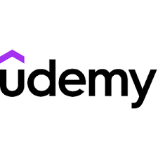

Udemy Clone

Udemy Clone is a responsive online learning platform built using HTML, CSS, and JavaScript. This project replicates the core layout and features of Udemy, showcasing courses, categories, recommended sections, and a user-friendly interface.

Features

Responsive Navbar with search bar and user icons

Category Section for different course topics

Popular & Recommended Courses with course cards (title, instructor, rating, price)

Sale/Banner Image Section to highlight promotions

Topics Section for trending skills

Footer with links, copyright, and logo

Fully responsive layout using CSS Flexbox and Grid

## 🖼️ Project Preview

### 🔹 Header and Navigation

### 🔹 Sale Banner

### 🔹 Recommended Courses

### 🔹 Footer

Tech Stack

HTML5

CSS3 (Flexbox & Grid)

CSS3 (Flexbox & Grid)

JavaScript (for interactivity, optional features like sorting)# udemy-clone
